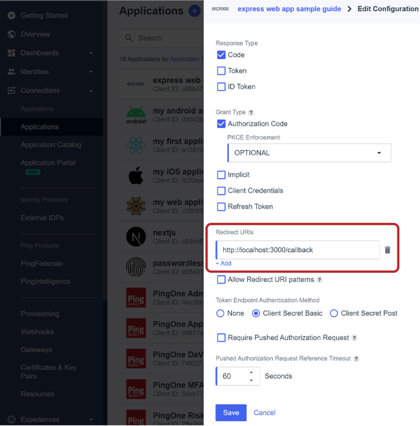

<picture>
  <source media="(prefers-color-scheme: dark)" type="image/svg" srcset="images/PingIdentity-dark.svg">
  <source media="(prefers-color-scheme: light)" type="image/svg" srcset="images/PingIdentity.svg">
  
</picture>

<picture>
  <source media="(prefers-color-scheme: light)" type="image/svg" srcset="images/PingOne.svg">
</picture>

# PingOne Quickstart Guide - Traditional Web App

###### Express, NodeJS, OAuth 2.0, OIDC, Authz Code Grant Type, Auth, PingOne

This guide illustrates the steps to integrate* a [PingOne authentication experience](https://apidocs.pingidentity.com/pingone/main/v1/api/#pingone-authentication-and-authorization) into a traditional web app. [Express](https://expressjs.com/) is used for the server which will also serve the UI with some basic HTML.

<small>*Using OIDC's [Authentication using the Authorization Code Flow](https://openid.net/specs/openid-connect-core-1_0.html#CodeFlowAuth)[^1]</small>

---

---

## Prerequisites

- [NodeJS](https://nodejs.org/en) (v2.0+)
- [A Modern Browser](https://www.google.com/chrome/)
- [A PingOne Account](https://www.pingidentity.com/en/try-ping.html) with
  - a test **PingOne Environment** with an **Identity/User** created there
  - a **PingOne Application Connection**
    - created using the `OIDC Web App` template
    - add the Redirect URI: `http://localhost:3000/callback`
    - don't forget to toggle it on!



## Create a `.env` File

> [!NOTE]
> The values for the environment file can be found on the Overview or the Configuration tab of your PingOne Application Connection

1. Duplicate or copy the `.env.EXAMPLE` template file from this repo and rename it `.env`
2. Fill in the configuration values from the PingOne App Connection

```shell
# Auth base url is dependent upon region
# e.g.,
# NA - https://auth.pingone.com
# CA - https:/auth.pingone.ca
# EU - https:/auth.pingone.eu
# APAC - https:/auth.pingone.asia
PINGONE_AUTH_BASE_URL=https://auth.pingone.com

# PingOne Environment ID
#z2345678-0000-456c-a657-3a21fc9ece7e
PINGONE_ENVIRONMENT_ID=

# PingOne App Connection Configuration Info
#x7654321-0000-4fc4-b8ed-1441b767e78f
PINGONE_CLIENT_ID=
#########-####-####-####-############
PINGONE_CLIENT_SECRET=

# The base path where this app is running
# Express defaults to localhost, update here otherwise
# The Hello world example uses port 3000 (it's configured in app.js)
APP_BASE_URL=http://localhost
```

---

## Install Dependencies

Run from the top level directory:

    npm install

---

> #### Tips
>
> - Open an incognito or private window so that no existing sessions are used
> - Open your browser's network tab in the developer tools
>   - enable recording
>   - preserve logs
>   - continue logging upon navigation
>     <small>\*(how and where to configure these settings will depend on your browser)</small>

---

# Walkthrough Guide

###### Try running the app at each step to check if the behavior matches your expectations

<small>* First run `npm install`</small>
<small>* Run the command from the top level directory.</small>

## Step 0 - A Functioning Express server

`npm run step0`

We'll start with a simple working example with [Express's Hello World example](https://expressjs.com/en/starter/hello-world.html)!
This step serves as a test to check whether your environment is properly set up, and it gives us something functional to start with and integrate PingOne into.

\*Some comments have been added for extra clarity

```javascript
/**
 * Express Server Config and Initialization
 */
const express = require("express");
const app = express();
const port = 3000;

/**
 * Root path - "http://localhost:3000/" (or without the explicit "/" => "http://localhost:3000")
 *
 * Navigating to the root path should render "Hello World!" in your browser.
 */
app.get("/", (req, res) => {
  res.send("Hello World!");
});

/**
 * This outputs a message to your terminal (wherever you ran the command to
 * start the app) when the Express server starts up.
 */
app.listen(port, () => {
  console.log(`Example app listening on port ${port}`);
});
```

---

## Step 1 - Preparing Needed Values

`npm run step1`

These values are from your PingOne App Connection config stored in the `.env` file:

```javascript
// PingOne Auth (authentication/authorization) base url
const authBaseURL = process.env.PINGONE_AUTH_BASE_URL;
// PingOne Environment ID (the ID of environment where the App Connection is
// located)
const envID = process.env.PINGONE_ENVIRONMENT_ID;
// PingOne Client ID of the App Connection
const clientID = process.env.PINGONE_CLIENT_ID;
// PingOne Client Secret of the App Connection
const clientSecret = process.env.PINGONE_CLIENT_SECRET;
// Express app (this app) base url (e.g., http://localhost)
const appBaseURL = process.env.APP_BASE_URL;
```

<br />

These values are for OIDC authentication with PingOne:

```javascript
// This app's base origin (e.g., http://localhost:3000)
const appBaseOrigin = appBaseURL + ":" + port;
// PingOne authorize endpoint
const authorizeEndpoint = "/as/authorize";
// PingOne token endpoint
const tokenEndpoint = "/as/token";
// The url path made available for when the user is redirected back from the
// authorization server, PingOne
const callbackPath = "/callback";
// The full url where the user is redirected after authenticating/authorizing
// with PingOne (e.g., http://localhost:3000/callback)
const redirectURI = appBaseOrigin + callbackPath;
// Scopes specify what kind of access the client is requesting from the user.
// These are some standard OIDC scopes.
//   openid - signals an OIDC request; default resource on oauth/oidc app
// connection
// These need to be added as resources to the app connection or it will be
// ignored by the authorization server. Once that's done, you can then append
// it to your scopes variable using a whitespace to separate it from any other
// scopes.
//   profile - access to basic user info;
//   p1:read:user - access to read the user's PingOne identity's attributes (a
// PingOne - specific scope)
const scopes = "openid";
// The OAuth 2.0 grant type and associated type of response expected from the
// /authorize endpoint. The Authorization Code flow is recommended as the best
// practice in most cases
// https://datatracker.ietf.org/doc/html/draft-ietf-oauth-security-topics-23
const grantType = "authorization_code";
const responseType = "code";
```

---

## Step 2 - Modifying the Root Path Logic

`npm run step2`

1. Instead of returning "Hello World" from the root path, we'll modify it to construct our authorization request as a URL and send it as the href of an HTML `a` tag (aka a link).
2. Once a user navigates their browser to the root path and clicks the login link, they'll be redirected to PingOne to authenticated and authorize any access she wishes to give the client.
3. If you try it out, after completing authentication,

   > **you'll see an error about a missing `callback` page. That's expected!**

   We've yet to set up that path on our server! We'll do that in step 4.

```javascript
/**
 * Root url - "http://localhost:3000/" (or without the explicit "/" =>
 * "http://localhost:3000")
 *
 * Creates and serves the authorization request as a plain link for the user to
 * click and start authentication.
 *
 * No longer will respond with "Hello World!"
 *
 * When someone navigates their browser, or user agent, to the root path, "/", a
 * basic link with the text "Login" is rendered. Clicking the link will redirect
 * the user to PingOne with the authorization request parameters. The user is
 * then prompted to authenticate.
 */
app.get("/", (req, res) => {
  // Authorization server's authorize endpoint's url path
  // e.g.,
  // "z2345678-0000-456c-a657-3a21fc9ece7e/as/authorize"
  const authzPath = envID + authorizeEndpoint;
  // authorize request starting with the url origin and path.
  const authzReq = new URL(authzPath, authBaseURL);

  // Add query parameters to define the authorize request
  authzReq.searchParams.append("redirect_uri", redirectURI);
  authzReq.searchParams.append("client_id", clientID);
  authzReq.searchParams.append("scope", scopes);
  authzReq.searchParams.append("response_type", responseType);

  // Send a link to the browser to render with the text "Login".
  // When the link is clicked the user is redirected to the authorization
  // server, PingOne, at the authorize endpoint. The query parameters are read
  // by PingOne and combine to make the authorization request.
  res.status(200).send("<a href=" + authzReq.toString() + ">Login</a>");
});
```

---

## Step 3 - Setting up the Redirect Path

`npm run step3`

Once the user has finished authentication with PingOne, you'll want them to return to your app, right?
Yes! Of, course! Well, that's exactly what the `redirect_uri` is for! It's sent as a parameter in the authorization request and then in the token request.

1. The `redirect_uri` is how PingOne knows where to send the user after authentication is completed.
    - \*For security, the `redirect_uri` must be registered with the authorization server, PingOne, first. This is what you did when you modified the App Connection's config and entered a value for the `redirect_uri`. Nice job, you.
2. In our app, we'll set up a listener for this path.
3. In the Authorization Code flow, we expect PingOne to send an authorization code (now, you see why they call it the "Authorization Code flow'? ;)) along with the user to our redirect path.
4. The Authorization Code will be in the query parameters of the request from PingOne.

    It should look something like this:

        http://localhost:3000/callback?code=1200111a-e3f5-0000-0000-1116a5443e33

5. We'll extract this code because we'll need it to exchange for tokens[^2]
6. We send the Token Request to the `/token` endpoitn, and we expect to get in return... tokens! Both an access token and id token in this case representing the user's authorization and identity information, respectively.

\*If this time you didn't have to login, PingOne found a live session! However, you can modify this behavior.

```javascript
/**
 * Callback url - "http://localhost:3000/callback"
 *
 * The path for the redirect_uri. When the user is redirected from PingOne, the
 * authorization code is extracted from the query parameters, then the token
 * request is constructed and submitted for access and id tokens.
 *
 * This path isn't meant to be manually navigated to. It serves as the location
 * for the user to be redirected to after interacting with PingOne, the
 * authorization server. If the user successfully authenticated/authorized with
 * PingOne, they'll be sent to here with an authorization code in the query
 * parameters which looks like (?code=<random-chars>). In this sample, the code
 * is left in the URL, so you can see what it looks like and how it's sent here,
 * but, in practice, you'll want to limit exposure to this value.
 */
app.get(callbackPath, async (req, res) => {
  // Try to parse the authorization code from the query parameters of the url.
  const authzCode = req.query?.code;

  // Send error if the authorization code was not found.
  if (!authzCode) {
    const errorMsg =
      "Expected authorization code in query parameters.\n" + req.url;
    console.error(errorMsg);
    res.status(404).send("<a href='/'>Return home</a>");
  }

  /**
   * Set headers for token request.
   */
  const headers = new Headers();
  // Content type
  headers.append("Content-Type", "application/x-www-form-urlencoded");
  // Authorization header
  // Calculated as the result of base64 encoding the string:
  // (clientID + ":" + clientSecret) and appended to "Basic ". e.g., "Basic
  // 0123456lNzQtZT3Mi00ZmM0WI4ZWQtY2Q5NTMwTE0123456=="
  const authzHeader =
    "Basic " + Buffer.from(clientID + ":" + clientSecret).toString("base64");
  headers.append("Authorization", authzHeader);

  // Use URLSearchParams because we're using
  // "application/x-www-form-urlencoded".
  const urlBodyParams = new URLSearchParams();
  // The grant type is the OAuth 2.0/OIDC grant type that the PingOne app
  // connection is configured to accept and was used for the authorization
  // request. Remember, this example is set up for Authorization Code.
  urlBodyParams.append("grant_type", grantType);
  // Include the authorization code that was extracted from the url.
  urlBodyParams.append("code", authzCode);
  // The redirect_uri is the same as what was sent in the authorize request. It
  // must be registered with PingOne by configuring the app connection.
  urlBodyParams.append("redirect_uri", redirectURI);

  // Options to supply the fetch function.
  const requestOptions = {
    method: "POST",
    headers: headers,
    body: urlBodyParams,
  };

  // PingOne token endpoint
  const tokenURL = authBaseURL + "/" + envID + tokenEndpoint;

  // Make the exchange for tokens by calling the /token endpoint and sending the
  // authorization code.
  try {
    // Send the token request and get the response body in JSON format.
    const response = await fetch(tokenURL, requestOptions);
    if (response.ok) {
      const result = await response.json();
      // For demo purposes, this forwards the json response from the token
      // endpoint.
      res.status(200).json(result);
    } else {
      res.status(response.status).send(response.json());
    }
  } catch (error) {
    // Handle error

    // For demo purposes, log the error to the server console and send the
    // error as a response.
    console.log(error);
    res.status(500).send(error);
  }
});
```

###### Congrats! You did it!

You've just walked through the steps to trigger authenticated a user with PingOne! The returned tokens serve as your proof.

---

## Common Errors and Potential Solutions

- If PingOne sends a redirect_uri mismatch error, check the PingOne app connection and that you've entered the redirect uri correctly.
- If PingOne sends a resource could not be found error, check the auth base url and that the App Connection has been turned on (flip the toggle on the app conenction)
- If you have problems just running `npm start`, delete `node_modules` and `package-lock.json` and run the `npm install` again. Then try starting the app again.

---

## What's next?

There are several different next steps you might take depending on your use case. Verifying the token(s), sending it in a request to PingOne, using token introspection, submitting a request to the resource server, and more.

<br />

But, first, you don't want to leave the authorization code in the url. It's done here so you can see how the flow works and what to expect when you integrate into your own app.

You'll want to either:

- remove it from the query parameters in the url before loading the UI
- use the `response_mode=form_post` in the authorization request so the code is sent in the body of a `POST` request[^3]

The authorization code *can* be used to get an access token in (additional protections exist like PKCE[^4]) if someone happens to get a look at that url or it can block you from getting an access token if someone else attempts to use it and the authorization server invalidates it as a precautionary measure before you get a chance to use it.

<br />

During testing, you can decode the token(s) with a [free Ping Identity tool](https://developer.pingidentity.com/en/tools/jwt-decoder.html), verify the signature, check if it's expired, and examine the claims contained within each token. 

**However, remember that these are `Bearer` tokens!** That means that these tokens are furry and like honey... I mean, whoever "bears" (aka holds) the tokens holds the power that they grant. This particular decoder runs client-side (a.k.a. exclusively in the browser), but you should still take extra care to make sure you don't give someone the keys to your kingdom!

[^1]: [Authentication using the Authorization Code Flow](https://openid.net/specs/openid-connect-core-1_0.html#CodeFlowAuth)
[^2]: [The `response_type` parameter](https://openid.net/specs/openid-connect-core-1_0.html#Authentication) can be used to return tokens in the authorization request without the code exchange
[^3]: [OpenID Connect - Form Post Response Mode](https://openid.net/specs/oauth-v2-form-post-response-mode-1_0.html#FormPostResponseMode)
[^4]: [RFC 7636]((https://datatracker.ietf.org/doc/html/rfc7636))