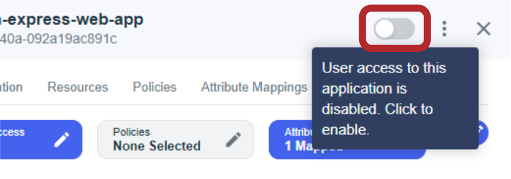

<picture>
  <source media="(prefers-color-scheme: dark)" type="image/svg" srcset="images/PingIdentity-dark.svg">
  <source media="(prefers-color-scheme: light)" type="image/svg" srcset="images/PingIdentity.svg">
  
</picture>

<picture>
  <source media="(prefers-color-scheme: light)" type="image/svg" srcset="images/PingOne.svg">
</picture>

# Integrating PingOne with a Web App

###### Express, Server, NodeJS, OAuth 2.0, OIDC, Authz Code Grant Type, Auth, PingOne

This guide shows you the steps needed to integrate[^1] a [PingOne authentication experience] into a _traditional_ web app (includes a server component as opposed to something that runs only on the client like a SPA). We'll start with a basic [Express] server with a simple UI.

---

---

## Prerequisites

|            |                     |   |                    |                  |   |                     |              |
|------------|---------------------|---|--------------------|------------------|---|---------------------|--------------|
| **NodeJS** | [v18.7.1+] required |   | **Modern Browser** | Such as [Chrome] |   | **PingOne Account** | [Free trial] |

### Setting up PingOne

> [!Note]
> See [Quick Start] in _PingOne for Developers_ for more information.

1. Create a test **environment** and **user** (with a password) if you haven't already.
2. Create an **app connection** in the test environment using the `OIDC Web App` template
3. On the configuration tab, add the **Redirect URI**: `http://localhost:3000/callback`
4. Ensure you enable the OIDC Web App connection using the toggle button!

<details>

**<summary>Click here to see what to look for</summary>**




</details>

### Creating the Environment File

> [!NOTE]
> The configuration values can be found on the Overview or the Configuration tab of your PingOne Application Connection

1. Duplicate the `.env.EXAMPLE` template file and rename the copy `.env` at the top directory of the repo.
2. Fill in the empty values with the corresponding ones from the PingOne App Connection.

[You can click me to take a closer look at the template file `.env.EXAMPLE`](.env.EXAMPLE "Template Environment File")

<details>

**<summary>Or click me to see the template here</summary>**

```shell
# Auth base url is dependent upon region
# e.g.,
# NA - https://auth.pingone.com
# CA - https:/auth.pingone.ca
# EU - https:/auth.pingone.eu
# APAC - https:/auth.pingone.asia
PINGONE_AUTH_BASE_URL=https://auth.pingone.com

# PingOne Environment ID
PINGONE_ENVIRONMENT_ID=

# PingOne App Connection Client ID and Secret
PINGONE_CLIENT_ID=
PINGONE_CLIENT_SECRET=

# The base path where this app is running
APP_BASE_URL=http://localhost
```

</details>

### Install packages

Run `npm install` or `yarn install` from the top of the repo. You only need to install once.

---

---

> [!NOTE]
>
> #### If you want to skip the step-by-step guide and jump straight to the final integration, go to [step 3](#step-3---setting-up-the-redirect-path "step 3")

# Walk-Through

The walk-through demonstrates the steps to add authentication to a basic web app. Each step can be run as its own isolated app and includes only what's been built up to that point. That way, it's easier to understand what each step does and how it builds on previous ones.

> [!Note]
> For a deeper dive into what's going on, open your browser's developer tools. The network tab is especially useful to see how the app interacts with PingOne and what's shown to the end user.
>
> Here are some helpful options* to enable before using the app:
>
> - record network log
> - preserve logs
> - preserve log upon navigation
>
>     <small>*These are from Chrome. The naming might be slightly different if a different browser is used.</small>

> [!IMPORTANT]
> **Stop the server (ctrl+c) between runs.**
> If you see the following error, it likely means there's a version of this app running somewhere (or something is already using port 3000):
>
> `Error: listen EADDRINUSE: address already in use :::3000`  

---

## Step 0 - Express server

##### Running `step0` spins up a simple express web app using [Express's Hello World example](https://expressjs.com/en/starter/hello-world.html)

Also, use this step to rule out any issues in your environment.

<sub>*Stop any other versions of this app (ctrl+C) from the terminal where you started the previous app</sub>

1. `npm run step0` from the root of the repo.
2. Open an incognito/private browser window
3. Navigate to [`http://localhost:3000`](http://localhost:3000 "port 3000 on http://localhost").
4. You should see "Hello World".

This step's source code can be found in [`step0/index.js`](step0/index.js "step0 source code")

<details>

**<summary>Or click me to view the code here</summary>**

```javascript
/**
 * Express Server Config and Init
 */
const express = require("express");
const app = express();
const port = 3000;

/**
 * Displays "Hello World!" when opening "http://localhost:3000" (trailing "/" not required in most cases) in a browser.
 */
app.get("/", (req, res) => {
  res.send("Hello World!");
});

/**
 * Terminal output message when the app starts.
 */
app.listen(port, () => {
  console.log(
    `The PingOne sample Express app has started listening on ${appBaseURL}:${port}`
  );
  console.log("Step 0 - Creating a working Express web app.");
});
```

</details>

---

## Step 1 - Preparing needed values

This step creates constants for the values you added in `.env` along with the OAuth 2.0/OIDC values that will be needed in later steps.

<sub>*Stop any other versions of this app (ctrl+C) from the terminal where you started the previous app</sub>

1. `npm run step1` from the root of the repo.
2. Refresh your browser or navigate to [`http://localhost:3000`](http://localhost:3000 "port 3000 on http://localhost").
3. You should see
  
        Hello Step1! Environment ID: <env-id> Client ID: <client-id>. If you're seeing "undefined", check that you've correctly created the .env file.

    **If you're not seeing ID values (they might be blank or show `undefined`), re-check that you've run through [Creating the Environment File](#creating-the-environment-file "Creating the Environment File").**

This step's source code can be found in [`step1/index.js`](step1/index.js "step1 source code")
  
<details>
  
**<summary>Or click me to view the code here</summary>**

###### Here, the PingOne App Connection config values stored in the `.env` file are read and assigned to constants

```javascript
// PingOne specific
// Auth base url
const authBaseURL = process.env.PINGONE_AUTH_BASE_URL;
// Environment ID (where the app and user are located)
const envID = process.env.PINGONE_ENVIRONMENT_ID;
// Client ID 
const clientID = process.env.PINGONE_CLIENT_ID;
// Client Secret
const clientSecret = process.env.PINGONE_CLIENT_SECRET;

// Base url of this app
const appBaseURL = process.env.APP_BASE_URL;
```

###### This section defines values needed for integrating PingOne authentication (using OIDC)

```javascript
// App's base origin (default is http://localhost:3000)
const appBaseOrigin = appBaseURL + ":" + port;
// Authorization endpoint
const authorizeEndpoint = "/as/authorize";
// Token endpoint
const tokenEndpoint = "/as/token";
// redirect_uri (e.g., http://localhost:3000/callback)
const callbackPath = "/callback";
const redirectURI = appBaseOrigin + callbackPath;
// Scopes specify what kind of access the client is requesting from the user.
//   openid - signals an OIDC request and is available by default
const scopes = "openid";

// The Authorization Code flow is a generally a good place to start
// https://datatracker.ietf.org/doc/html/draft-ietf-oauth-security-topics-23
const grantType = "authorization_code";
const responseType = "code";
```

</details>

---

## Step 2 - Modifying the Root Path Logic

##### Redirect the user to PingOne to authenticate

- Instead of only displaying text from the root path, we'll modify it to construct our authorization request as a URL and send it as a clickable "Login" link.
- Once a user navigates their browser to the root path and clicks the login link, they'll be redirected to PingOne to authenticate and authorize any access she wishes to give the client.

<br />

> [!IMPORTANT]
>
> You _will_ see a `Cannot get /callback` **error message** after clicking `Login` and authenticating (or authentication might be skipped if a live session is found).
> **This error is expected!** We've not yet set up the redirect path, `/callback`. The next step will show you how to do that.

<sub>*Stop any other versions of this app (ctrl+C) from the terminal where you started the previous app</sub>

1. `npm run step2` from the root of the repo.
2. Refresh your browser or navigate to [`http://localhost:3000`](http://localhost:3000 "port 3000 on http://localhost").
3. Click the `Login` link
4. Login with your test user
5. You should see the `Cannot get /callback` error message

This step's source code can be found in [`step2/index.js`](step2/index.js "step2 source code")
  
<details>
  
**<summary>Or click me to view the code here</summary>**

```javascript
/**
 * Navigating to http://localhost:3000 displays a "Login" link.
 * Clicking the link will redirect the user to PingOne with the
 * authorization request parameters. This is a simplified way to make the
 * authorization request. It could instead be tied to a nicer looking button.
 * The user authenticates with PingOne and then is returned to the app via the redirect_uri.
 * In this app, the redirect_uri is configured as a different path, but it could be the same.
 */
app.get("/", (req, res) => {
  // Authorization server's authorize endpoint's url path
  // e.g.,
  // "z2345678-0000-456c-a657-3a21fc9ece7e/as/authorize"
  const authzPath = envID + authorizeEndpoint;
  // authorize request starting with the url origin and path.
  const authzReq = new URL(authzPath, authBaseURL);

  // Add query parameters to define the authorize request
  authzReq.searchParams.append("redirect_uri", redirectURI);
  authzReq.searchParams.append("client_id", clientID);
  authzReq.searchParams.append("scope", scopes);
  authzReq.searchParams.append("response_type", responseType);

  // Send a link to the browser to render with the text "Login".
  // When the link is clicked the user is redirected to the authorization
  // server, PingOne, at the authorize endpoint. The query parameters are read
  // by PingOne and combine to make the authorization request.
  res.status(200).send("<a href=" + authzReq.toString() + ">Login</a>");
});
```

</details>

---

## Step 3 - Setting up the Redirect Path

##### This step adds in a new `/callback` path for the `redirect_uri` and extracts the **authorization code** from the query parameters of the url.[^2]

- After the user authenticates, PingOne uses the `redirect_uri` to redirect the browser (and user user) and sends along the **authorization code** as the value of the `code` parameter:
  
  `http://localhost:3000/callback?code=<uuid>`
  
  - <small>_For security_, the `redirect_uri` must be configured on the Application Connection before performing authentication. PingOne will return an error if the `redirect_uri` provided in the authorization request is not configured on the Connection.</small>
- The code is exchanged for tokens with a Token Request at the `/token` endpoint to get . . . tokens!
  - <small>*Both an _access token_ and _id token_ are returned (because `openid` was included as a scope) which represent the _authorization_ and _authentication_, respectively.</small>

<sub>*Stop any other running versions of this app (ctrl+C) from the terminal where you started the previous app</sub>

1. `npm run step3` from the root of the repo.
2. Refresh your browser or navigate to [`http://localhost:3000`](http://localhost:3000 "port 3000 on http://localhost").
3. Click the `Login` link
4. Login with your test user (skipped if a session is found; close and open a new incognito window to see the login page instead)
5. You should expect to now see some JSON in your browser with an `access_token` key and value.

<small>\*If this time you didn't have to login, PingOne found a live session! However, you can modify this behavior.</small>

This step's source code can be found in [`step3/index.js`](step3/index.js "step3 source code")
  
<details>
  
**<summary>Or click me to view the code here</summary>**

```javascript
/**
 * Callback url - "http://localhost:3000/callback"
 *
 * The path for the redirect_uri. When the user is redirected from PingOne, the
 * authorization code is extracted from the query parameters, then the token
 * request is constructed and submitted for access and id tokens.
 */
app.get(callbackPath, async (req, res) => {
  // Try to parse the authorization code from the query parameters of the url.
  const authzCode = req.query?.code;

  // Send error if the authorization code was not found.
  if (!authzCode) {
    const errorMsg =
      "Expected authorization code in query parameters.\n" + req.url;
    console.error(errorMsg);
    res.status(404).send("<a href='/'>Return home</a>");
  }

  /**
   * Set headers for token request.
   */
  const headers = new Headers();
  // Content type
  headers.append("Content-Type", "application/x-www-form-urlencoded");
  // Authorization header
  // Calculated as the result of base64 encoding the string:
  // (clientID + ":" + clientSecret) and appended to "Basic ". e.g., "Basic
  // 0123456lNzQtZT3Mi00ZmM0WI4ZWQtY2Q5NTMwTE0123456=="
  const authzHeader =
    "Basic " + Buffer.from(clientID + ":" + clientSecret).toString("base64");
  headers.append("Authorization", authzHeader);

  // Use URLSearchParams because we're using
  // "application/x-www-form-urlencoded".
  const urlBodyParams = new URLSearchParams();
  // The grant type used for the OAuth 2.0/OIDC Authorization Code flow.
  urlBodyParams.append("grant_type", grantType);
  // Include the authorization code that was extracted from the url.
  urlBodyParams.append("code", authzCode);
  // The redirect_uri is the same as what was sent in the authorize request.
  urlBodyParams.append("redirect_uri", redirectURI);

  // Options to supply the fetch function.
  const requestOptions = {
    method: "POST",
    headers: headers,
    body: urlBodyParams,
  };

  // PingOne token endpoint
  const tokenURL = authBaseURL + "/" + envID + tokenEndpoint;

  // Make the exchange for tokens by calling the /token endpoint and sending the
  // authorization code.
  try {
    // Send the token request and get the response body in JSON format.
    const response = await fetch(tokenURL, requestOptions);
    if (response.ok) {
      const result = await response.json();
      // For demo purposes, this forwards the json response from the token
      // endpoint.
      res.status(200).json(result);
    } else {
      res.status(response.status).send(response.json());
    }
  } catch (error) {
    // Handle error

    // For demo purposes, log the error to the server console and send the
    // error as a response.
    console.log(error);
    res.status(500).send(error);
  }
});
```

</details>

<br />

---

### Congrats! You did it

You've just walked through the steps to authenticate a user with PingOne! The returned tokens serve as your proof.

---

## Common Errors and Potential Solutions

- If PingOne sends a redirect_uri mismatch error, check the PingOne app connection and that you've entered the redirect uri correctly.
- If PingOne sends a resource could not be found error, check the auth base url and that the App Connection has been turned on (flip the toggle on the app conenction)
- If you're having trouble authenticating with a user, make sure that user's identity exists in the same environment as the App Connection.
- If you have problems just running `npm run <step + #>`, delete `node_modules` and `package-lock.json` and run the `npm install` again. Then try starting the app again.
- If you see the following error in the terminal after clicking the Login link in Step 3
  `UnhandledPromiseRejectionWarning: ReferenceError: Headers is not defined`
  Make sure your version of Node meets [the min. version described in the prerequisites](#prerequisites "Prerequisites").

---

## What's next?

There are several different next steps you might take depending on your use case. Verifying the token(s), sending it in a request to PingOne, using token introspection, submitting a request to the resource server, and more.

<br />

But, first, you don't want to leave the authorization code in the url. It's done here so you can see how the flow works and what to expect when you integrate into your own app.

You'll want to either:

- remove it from the query parameters in the url before loading the UI
- use the `response_mode=form_post` in the authorization request so the code is sent in the body of a `POST` request[^3]

The authorization code _can_ be used to get an access token in (additional protections exist like PKCE[^4], which you should use) if someone happens to get a look at that url or it can block you from getting an access token if someone else attempts to use it and the authorization server invalidates it as a precautionary measure before you get a chance to use it.

<br />

During testing, you can decode the token(s) with a [free Ping Identity tool](https://developer.pingidentity.com/en/tools/jwt-decoder.html), verify the signature, check if it's expired, and examine the claims contained within each token.

###### However, remember that these are `Bearer` tokens!**

Whoever "bears" (aka holds) the tokens holds the powers that they grant. This particular decoder runs client-side (i.e., exclusively in the browser), but you should still take extra care to make sure you don't give someone the keys to your kingdom!

[PingOne authentication experience]: https://apidocs.pingidentity.com/pingone/main/v1/api/#pingone-authentication-and-authorization "PingOne API Docs"
[Express]: https://expressjs.com/ "Express"
[v18.7.1+]: https://nodejs.org/en "Download NodeJS"
[Chrome]: https://www.google.com/chrome/ "Download Chrome"
[Free trial]: https://www.pingidentity.com/en/try-ping "Sign up for a free trial of PingOne"
[Quick Start]: https://apidocs.pingidentity.com/early-access/mainPOC/v1/api/#quick-start "PingOne Quick Start Docs"

[^1]: [Authentication using the Authorization Code Flow](https://openid.net/specs/openid-connect-core-1_0.html#CodeFlowAuth)
[^2]: [The `response_type` parameter](https://openid.net/specs/openid-connect-core-1_0.html#Authentication) can be used to return tokens in the authorization request without the code exchange
[^3]: [OpenID Connect - Form Post Response Mode](https://openid.net/specs/oauth-v2-form-post-response-mode-1_0.html#FormPostResponseMode)
[^4]: [RFC 7636]((https://datatracker.ietf.org/doc/html/rfc7636))
